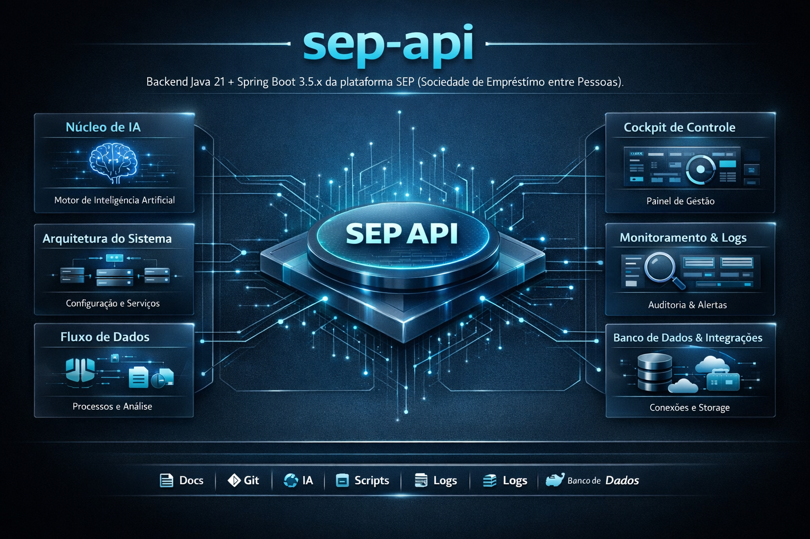

# Arquitetura Técnica Geral — sep-api

## 1. Topologia e Visão Geral
A arquitetura do **sep-api** baseia-se no padrão arquitetural DevOps Global da Dynamis Tecnologia, garantindo segregação de responsabilidades e isolamento de domínios.

## Infográfico Geral

## 2. Camadas do Sistema
- **Camada de Apresentação / UI**: Baseada nos mockups de interface encontrados em `image/mockups/`.
- **Lógica de Negócio (Core)**: Desenvolvido utilizando as melhores diretrizes da stack **Java**.
- **Camada de Persistência / Banco**: Migrations e conexões gerenciadas centralizadamente.

## 3. Diretrizes de Segurança
Todos os tokens de APIs e segredos são mascarados visualmente e criptografados localmente.

---
<i>Documento gerado de forma autônoma por IA para o sep-api — Semantic Docs AI.</i>
